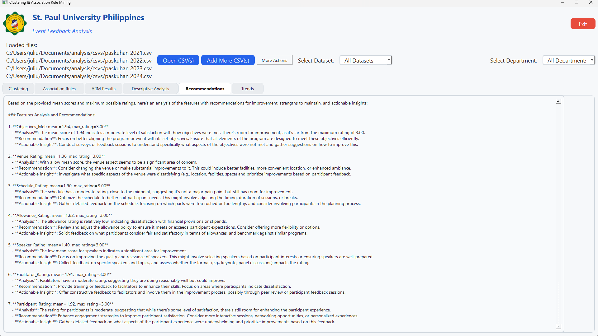

# Clustering & Association Rule Mining Analysis App

## Introduction & Context
This application is a modern PyQt5-based GUI for interactive data analysis, clustering, association rule mining, and AI-powered recommendations. It is designed for CSV datasets with both numeric and categorical data, supporting multi-file loading, department/dataset filtering, export features, and project save/load.

**Purpose:**
- To provide an end-to-end, user-friendly tool for analyzing event feedback or similar survey data.
- To enable both technical and non-technical users to extract actionable insights from raw data using advanced analytics and AI.
- To support academic, institutional, or organizational research, especially for thesis/defense presentations.

**Intended Use:**
- For students, researchers, or analysts preparing reports or defenses involving clustering, association rule mining, and descriptive analytics.
- As a reviewer's guide to understand, verify, and interpret the results and methodology.

---

## Screenshots

Below are screenshots of the application to guide reviewers through the main features and workflow. Each image demonstrates a key part of the analysis process or UI:

1. **Loading CSV Data**

   

   *The file selection dialog and initial data loading interface.*

2. **On Load CSV (Preview)**

   

   *Preview of loaded data and department selection.*

3. **Saving Project**

   

   *Save your analysis state for later use.*

4. **Saving Project (Confirmation)**

   

   *Confirmation dialog after saving a project.*

5. **Setting Rating Ranges**

   

   *Customize the rating ranges for feature interpretation.*

6. **Clustering Results Plot**

   

   *Visualization of KMeans clustering results.*

7. **Elbow Method & Silhouette Score**

   

   *Popup showing k selection using the elbow and silhouette methods.*

8. **Association Rule Network Plot**

   

   *Network plot of discovered association rules.*

9. **ARM Results Table**

   

   *Tabular view of association rules (antecedents, consequents, support, confidence, lift).*

10. **Descriptive Analysis Histogram**

    

    *Histograms and summary statistics for numeric features.*

11. **Recommendations Tab**

    

    *AI-generated recommendations based on feature means and ratings.*

12. **Trends Plot**

    

    *Feature means across years, with AI trend analysis.*

---

## Workflow: Step-by-Step Usage & Reviewer Guidance

### 1. **Launching the App**
- Run the script with `python analysis-script.py` after installing requirements.
- The app opens in fullscreen with a modern UI, showing tabs for each analysis type.

### 2. **Loading Data**
- Click **Open CSV(s)** to load one or more CSV files. Each file should contain survey or event feedback data, with both numeric (e.g., ratings) and categorical (e.g., department) columns.
- Use **Add More CSV(s)** to append additional datasets.
- The **Select Dataset** dropdown lets you choose between all loaded datasets or a specific one.
- The **Select Department** dropdown filters analysis by department (if present in the data).

**Reviewer Tip:**
- Check that the loaded data matches expectations (column names, types, completeness).
- Verify that department and dataset selection updates the analysis accordingly.

### 3. **Tabs Overview**
- **Clustering:** Visualizes KMeans clustering results, shows cluster profiles, and provides AI interpretation.
- **Association Rules:** Shows a network plot of discovered association rules and an AI summary.
- **ARM Results:** Tabular view of all association rules (antecedents, consequents, support, confidence, lift).
- **Descriptive Analysis:** Numeric and categorical summaries, histograms, and AI insights.
- **Recommendations:** AI-generated recommendations based on feature means and ratings.
- **Trends:** Plots feature means across years (from filenames) and provides AI trend analysis.

**Reviewer Tip:**
- Each tab is self-contained. Reviewers should check that the analysis updates when changing dataset/department.
- Use the **More Actions** menu for project save/load, PDF export, rating range customization, and dataset removal.

### 4. **Exporting & Saving**
- **Export to PDF:** Saves all plots, tables, and AI analyses in a formatted PDF for documentation or defense submission.
- **Save/Load Project:** Store and restore the entire analysis state, including loaded data and AI outputs.

---

## Theoretical Background & Interpretation

### Clustering (KMeans)
- **Goal:** Group similar data points (e.g., survey responses) into clusters based on their numeric features.
- **Algorithm:**
  - KMeans partitions data into k clusters by minimizing within-cluster sum of squares:
    \[
    \text{argmin}_C \sum_{i=1}^k \sum_{x \in C_i} \|x - \mu_i\|^2
    \]
    where $\mu_i$ is the centroid of cluster $C_i$.
- **k Selection:**
  - **Elbow Method:** Plots inertia (sum of squared distances to cluster centers) for different k. The "elbow" point suggests a good k.
  - **Silhouette Score:** Measures how well each point fits within its cluster vs. others:
    \[
    s = \frac{b - a}{\max(a, b)}
    \]
    where $a$ is the mean intra-cluster distance, $b$ is the mean nearest-cluster distance.
  - The app automatically selects k using the highest silhouette score and shows both plots in a popup.
- **Preprocessing:**
  - Standard scaling of all numeric columns (`StandardScaler`).
  - If there are few features, PCA (Principal Component Analysis) is used for 2D visualization.
- **Interpretation:**
  - Each cluster represents a group of similar responses. The cluster center shows the average feature values for that group.
  - The AI provides a plain-language summary and suggested labels for each cluster.

**Reviewer Tip:**
- Check that the number of clusters (k) is justified by the silhouette and elbow plots.
- Review the AI interpretation for plausibility and alignment with the cluster profiles.

### Principal Component Analysis (PCA)
- **Purpose:** Reduce dimensionality for visualization and to capture the main variance in the data.
- **Math:** Projects data onto directions of maximum variance (eigenvectors of the covariance matrix).
- **Interpretation:**
  - PCA plots (if shown) help visualize clusters in 2D, but do not affect the clustering itself.

### Association Rule Mining (Apriori & ARM)
- **Goal:** Discover interesting relationships (rules) between categorical features or binned numeric features.
- **Preprocessing:**
  - Categorical columns: fill NaNs, lowercase, strip, rare values replaced with 'other'.
  - Numeric columns: binned into 3 quantiles (low, medium, high) and added as categorical features.
  - One-hot encoding (`pd.get_dummies`).
- **Apriori Algorithm:**
  - Finds frequent itemsets with minimum support.
    - **Support:**
      \[
      \text{support}(A) = \frac{\text{count}(A)}{N}
      \]
  - **Association Rules:**
    - **Confidence:**
      \[
      \text{confidence}(A \Rightarrow B) = \frac{\text{support}(A \cup B)}{\text{support}(A)}
      \]
    - **Lift:**
      \[
      \text{lift}(A \Rightarrow B) = \frac{\text{confidence}(A \Rightarrow B)}{\text{support}(B)}
      \]
- **Plot:**
  - Nodes: items (feature=value).
  - Edges: rules (A→B), width by lift.
- **Interpretation:**
  - Strong rules (high support, confidence, lift) indicate meaningful associations.
  - The AI summarizes the most important or actionable rules.

**Reviewer Tip:**
- Check that the rules make sense given the data context.
- High lift (>1) suggests a strong association; low support/confidence may indicate spurious rules.
- Review the AI analysis for insightfulness and relevance.

### Descriptive Analysis
- **Numeric summary:** min, max, mean, median, std, skew/shape for each numeric column.
- **Categorical summary:** value counts for each categorical column.
- **Histograms:**
  - All numeric columns shown, 20 bins per histogram.
  - Each feature's mean is rated using customizable rating ranges (e.g., needs improvement, satisfactory, etc.).
- **AI Analysis:**
  - Groq AI interprets the stats and provides recommendations.

**Reviewer Tip:**
- Check that the numeric and categorical summaries match expectations.
- Review the AI's descriptive analysis for accuracy and actionable insights.

### Recommendations & Trends
- **Recommendations:**
  - AI-generated, based on feature means, ratings, and department.
  - Should highlight strengths, weaknesses, and actionable steps.
- **Trends:**
  - Plots feature means across years (from dataset filenames).
  - AI trend analysis interprets and provides insights on improving, declining, or stable features.

**Reviewer Tip:**
- Look for consistency between trends, recommendations, and the underlying data.
- Ensure that AI-generated recommendations are specific and relevant.

---

## Example Scenarios & Interpretation Guidance

- **Scenario 1:** Clustering reveals three groups: one with high satisfaction, one with moderate, and one with low. The AI labels them as "Highly Satisfied", "Moderately Satisfied", and "Needs Improvement". Reviewer should check if these labels match the cluster centers.
- **Scenario 2:** Association rules show that "Department = IT" and "Rating = high" often occur together. Reviewer should verify if this is reflected in the data and if the rule's support/confidence is meaningful.
- **Scenario 3:** Trends tab shows a decline in "Event Organization" scores over years. AI recommends focusing on logistics. Reviewer should check if the plotted means support this conclusion.

---

## Role of Groq AI & Reviewer Assessment

- **What Groq AI Does:**
  - Interprets cluster centers, association rules, descriptive stats, and trends.
  - Generates plain-language summaries, recommendations, and insights.
- **What to Expect:**
  - AI outputs should be relevant, concise, and actionable.
  - They should not contradict the data or plots.
- **How to Critically Assess:**
  - Compare AI summaries to the actual data and plots.
  - Look for generic or boilerplate responses; good AI output should reference specific features, clusters, or rules.
  - If AI output seems off, check the prompt and data context.

---

## Limitations, Assumptions, and Extensions

- **Limitations:**
  - Only supports CSV files with appropriate structure (numeric/categorical columns).
  - Groq AI requires internet and a valid API key.
  - Association rules may be sparse if data is small or lacks categorical diversity.
  - Project save/load uses Python pickle (not cross-language portable).
- **Assumptions:**
  - Data is clean or at least consistently formatted.
  - Department and year can be extracted from columns or filenames.
- **Possible Extensions:**
  - Support for more clustering algorithms (e.g., DBSCAN, hierarchical).
  - Customizable association rule thresholds per analysis.
  - More advanced visualizations (e.g., heatmaps, interactive plots).
  - Integration with other LLMs or local AI models.

---

## Glossary of Key Terms

- **Cluster:** A group of similar data points identified by the KMeans algorithm.
- **Centroid:** The mean position of all points in a cluster.
- **Inertia:** Sum of squared distances from each point to its cluster center (used in elbow method).
- **Silhouette Score:** Metric for cluster quality; higher is better.
- **PCA (Principal Component Analysis):** Technique to reduce data dimensionality while preserving variance.
- **Apriori Algorithm:** Method to find frequent itemsets in categorical data.
- **Association Rule:** An implication of the form A ⇒ B, meaning if A occurs, B is likely to occur.
- **Support:** Proportion of data containing an itemset.
- **Confidence:** Likelihood that B occurs when A occurs.
- **Lift:** How much more likely B is to occur with A than by chance.
- **Groq AI:** Large language model used for generating natural language analysis and recommendations.

---

## FAQ & Reviewer Tips

**Q: What should I look for in the clustering results?**
- Check that clusters are well-separated (high silhouette score), and that AI interpretations match the cluster profiles.

**Q: How do I know if association rules are meaningful?**
- Look for rules with high support, confidence, and lift. Rules should make sense in the context of the data.

**Q: What if the AI output seems generic or off-topic?**
- Review the data and prompts. Consider re-running the analysis or refining the data.

**Q: Can I trust the AI recommendations?**
- Use them as a guide, but always cross-check with the actual data and plots.

**Q: How do I export results for my defense?**
- Use the **Export to PDF** feature to generate a comprehensive report with all plots, tables, and AI analyses.

**Q: What if I encounter errors?**
- The app displays error messages in the UI. Check data format, required columns, and dependencies.

---

## Requirements
- Python 3.7+
- PyQt5
- pandas
- scikit-learn
- matplotlib
- networkx
- mlxtend
- reportlab (for PDF export)
- groq (for AI recommendations)
- python-dotenv (for configuration)

## How to Run
1. Install requirements:
   ```bash
   pip install pyqt5 pandas scikit-learn matplotlib networkx mlxtend reportlab groq python-dotenv
   ```
2. (Optional) Place your logo and set up `.env` for branding.
3. Run the script:
   ```bash
   python analysis-script.py
   ```
4. Use the UI to load data, analyze, and export results. Use the **More Actions** menu for project save/load, PDF export, rating range customization, and dataset removal.

## Notes
- The app is designed for fullscreen use, but adapts to your screen size.
- All data is processed locally except for Groq AI calls (which require an API key).
- Project save/load uses Python pickle format (`.pkl`).
- Error messages are shown in the UI if analysis fails.
- AI analyses are cached per dataset/department for efficiency.

---

Feel free to modify the code for your own analysis needs!
